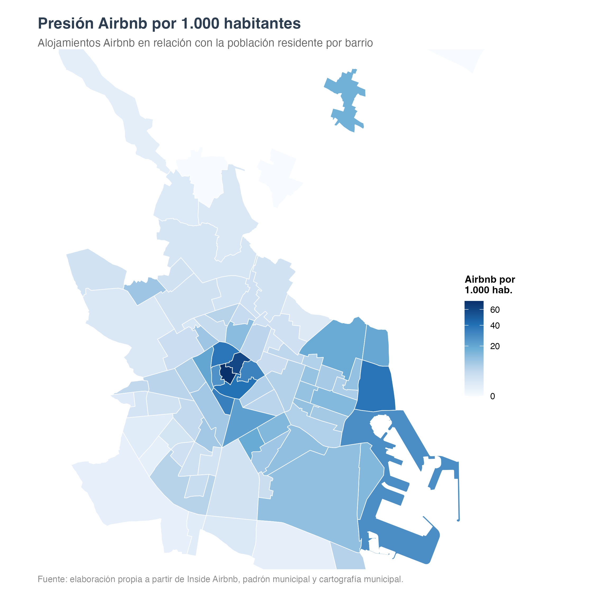
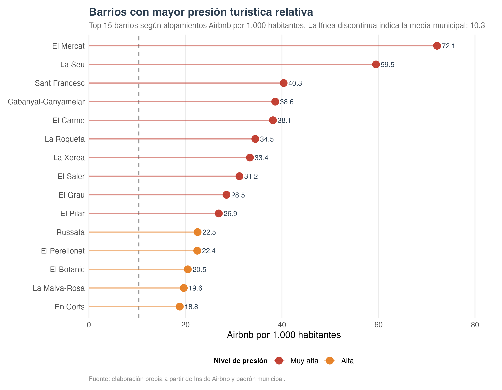
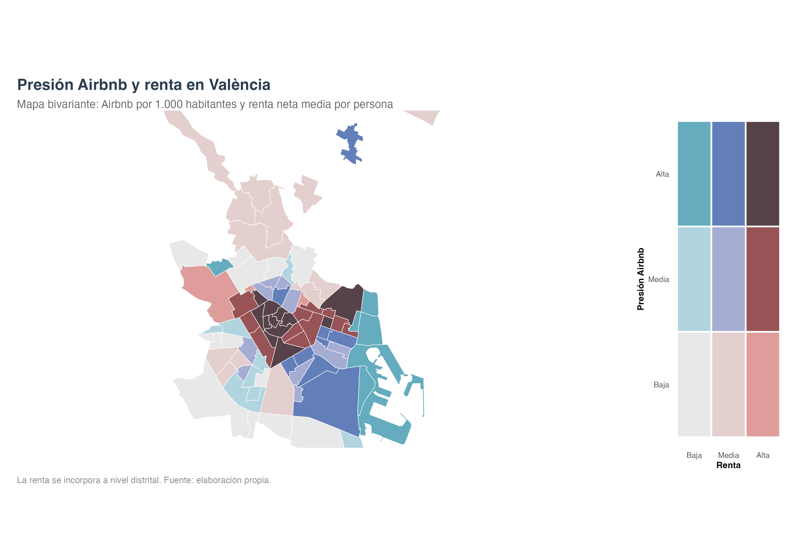
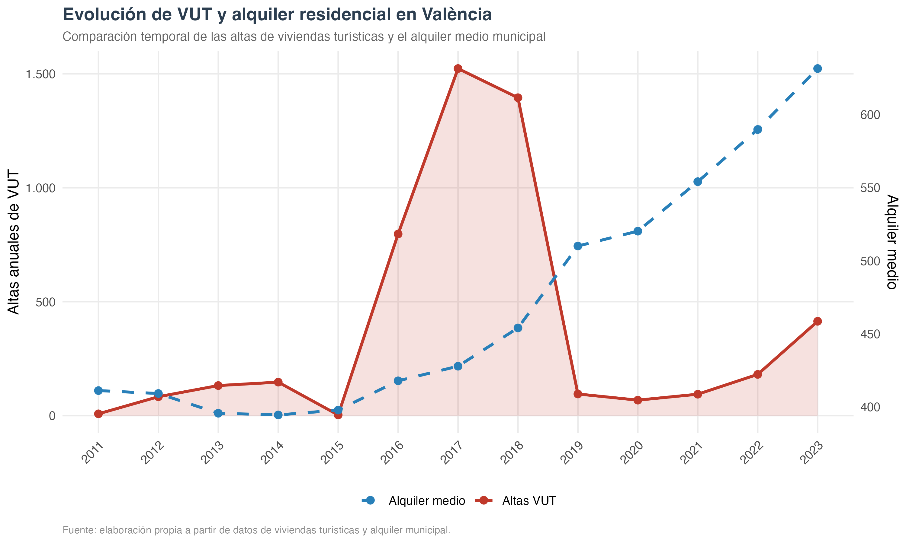
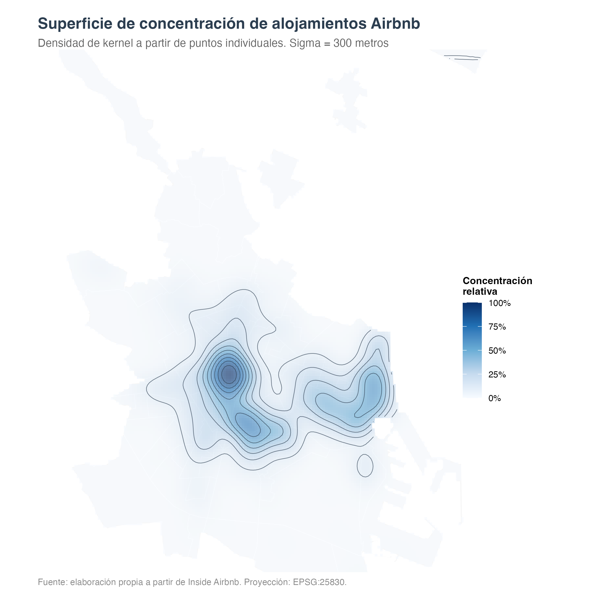
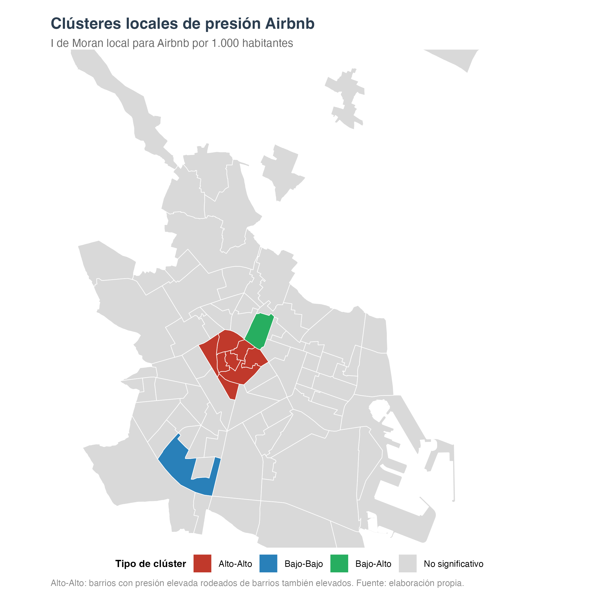
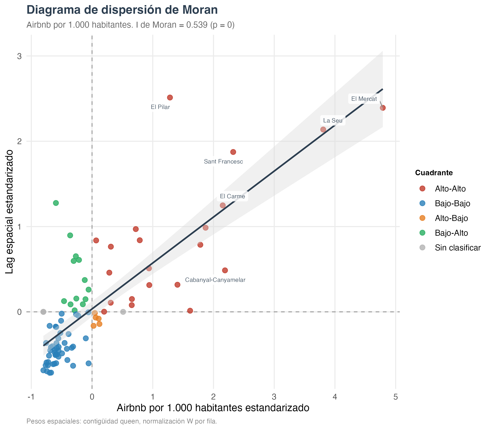
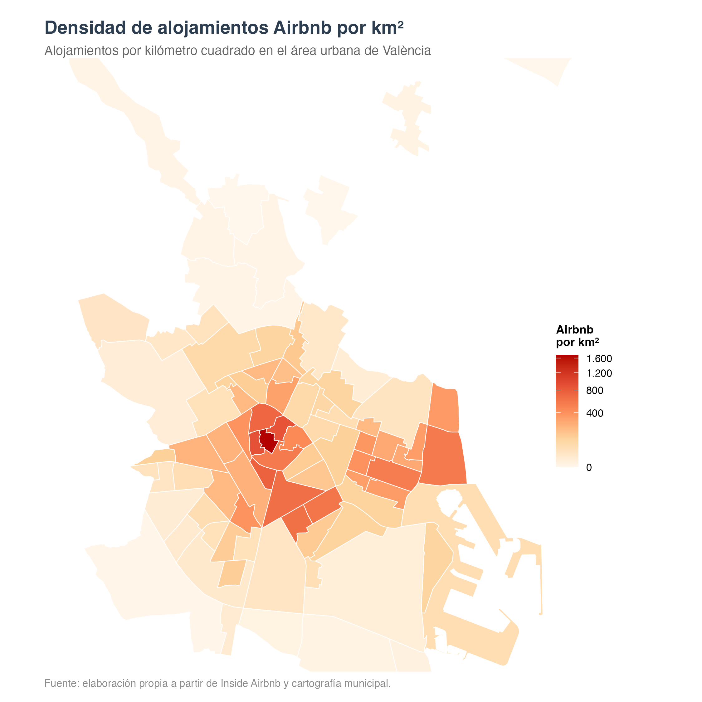

```{r setup}
knitr::opts_chunk$set(
  echo = FALSE,
  warning = FALSE,
  message = FALSE
)
```

# Introducción

La expansión de las plataformas digitales de alquiler turístico ha transformado la forma en que se organiza una parte del alojamiento urbano. En el caso de Airbnb, el alojamiento turístico ya no depende únicamente de hoteles o apartamentos reglados, sino también de viviendas insertas en barrios residenciales. Esta situación resulta especialmente relevante en ciudades con una fuerte presión turística y residencial, como Valencia.

La literatura académica ha señalado que Airbnb puede adoptar formas muy distintas según el tipo de oferta que domina en cada ciudad. En un extremo se encuentra el discurso de la economía colaborativa, asociado al uso temporal de recursos infrautilizados. En el otro extremo aparece un modelo profesionalizado, centrado en viviendas completas, multigestores y áreas de alta rentabilidad turística. Para el caso de València, Gil García (2021), en su trabajo "Turistificación, rentas inmobiliarias y acumulación de capital a través de Airbnb. El caso de Valencia", identifica un modelo con fuerte peso comercial, concentración en zonas turísticas y vinculación con procesos de turistificación. Este trabajo parte de esa discusión, pero actualiza la mirada mediante un análisis espacial reproducible a escala de barrio.

El objetivo del informe es analizar la distribución espacial de los alojamientos Airbnb en València y estudiar qué barrios presentan mayor presión relativa sobre la población residente. El análisis combina datos de Airbnb, población, cartografía municipal, renta, viviendas turísticas oficiales y alquiler residencial.

La pregunta principal es la siguiente: ¿en qué barrios de València se concentra la presión turística asociada a Airbnb y cómo se relaciona esta concentración con la población residente y el contexto socioeconómico?

# Marco académico

El análisis se apoya en cuatro referencias académicas. Se utilizan como base para situar la pregunta de investigación y para interpretar los resultados con cautela.

En primer lugar, Ortuño y Jiménez (2019) analizan la economía de plataformas y el turismo en España a través de Airbnb. Su aportación resulta útil porque sitúa el fenómeno en un marco estatal y diferencia entre dos lógicas turísticas relevantes: el turismo cultural de los centros urbanos y el turismo residencial de sol y playa. Valencia combina elementos de ambas lógicas: cuenta con un centro histórico visitado, barrios litorales y un mercado residencial sometido a presión.

En segundo lugar, Martínez-Caldentey, Murray y Blázquez-Salom (2020) estudian el caso de Madrid y muestran la tensión entre alquiler turístico y alquiler residencial. Su trabajo no se toma como explicación directa de Valencia, ya que Madrid tiene una estructura urbana y turística distinta. Sin embargo, sí funciona como antecedente para comprender la importancia de trabajar con análisis espacial, cartografía e indicadores intraurbanos. El caso madrileño muestra que la concentración del alquiler turístico en áreas centrales no es solo una cuestión de turismo, sino también una cuestión residencial.

En tercer lugar, Gil García (2021) constituye la referencia principal porque estudia directamente el caso de Valencia. El autor observa que Airbnb no funciona únicamente como alojamiento colaborativo, sino que se relaciona con rentas inmobiliarias, viviendas completas, multigestores profesionalizados y concentración en zonas turísticas. Este informe no replica exactamente su metodología, ya que trabaja con datos y escalas diferentes, pero sus resultados se leen en diálogo con ese antecedente.

Por último, Gutiérrez, García-Palomares, Romanillos y Salas-Olmedo (2017) estudian Barcelona y comparan la distribución espacial de Airbnb con hoteles y espacios turísticos. Esta referencia se incorpora como comparación metodológica, no como evidencia directa sobre Valencia. Barcelona y Valencia son ciudades distintas, con escalas, trayectorias turísticas y mercados de vivienda diferentes. Aun así, el trabajo de Gutiérrez resulta relevante porque usa indicadores de presión sobre población residente y técnicas de análisis espacial, como Moran y LISA, próximas a las empleadas en este informe.

A partir de estas referencias, el trabajo adopta una posición concreta: Airbnb se analiza como un fenómeno turístico, pero también como un fenómeno urbano y residencial. Por esta razón, el indicador central no es únicamente el número total de alojamientos, sino la relación entre alojamientos y población residente.

# Datos y fuentes

El análisis combina fuentes abiertas e institucionales. La base de alojamientos procede de Inside Airbnb. La cartografía de barrios y secciones censales procede de fuentes municipales y de datos abiertos. La información de población se basa en el padrón municipal por barrios. Los datos de viviendas turísticas oficiales proceden del portal de datos abiertos de la Generalitat Valenciana. La renta se incorpora a partir de indicadores del Instituto Nacional de Estadística. La información municipal de contexto se apoya en el anuario estadístico del Ayuntamiento de València.

Las principales fuentes de datos son las siguientes:

-   Inside Airbnb: alojamientos turísticos publicados en la plataforma.
-   Generalitat Valenciana: viviendas turísticas oficiales.
-   Ayuntamiento de València: cartografía, padrón y anuario estadístico.
-   Instituto Nacional de Estadística: indicadores de renta.
-   datos.gob.es: catálogo de datos territoriales.
-   Universitat de València: repositorio de datasets.

La ciudad de Valencia contaba con 844.424 habitantes a 1 de enero de 2025, según el Padrón Municipal de Habitantes. El mismo documento recoge una superficie municipal de 17.209,9 hectáreas y una densidad de 49,1 habitantes por hectárea. Estos datos sitúan el análisis en un municipio denso y demográficamente dinámico, donde la relación entre usos turísticos y población residente tiene relevancia territorial.

# Metodología

El trabajo se estructura en cuatro fases. La primera fase corresponde a la revisión de datos. En ella se comprueba la estructura de carpetas, el formato de los archivos, el número de filas y columnas, los nombres de las variables y los sistemas de referencia espacial.

La segunda fase corresponde a la limpieza y preparación. Los alojamientos Airbnb se transforman en puntos espaciales a partir de longitud y latitud. Después se cruzan con la cartografía de barrios para obtener indicadores agregados por barrio. Esta fase también incorpora la limpieza de población, renta, alquiler residencial y viviendas turísticas oficiales.

La tercera fase calcula indicadores descriptivos. Los indicadores más importantes son:

-   total de alojamientos Airbnb por barrio;
-   alojamientos Airbnb por 1.000 habitantes;
-   alojamientos Airbnb por km²;
-   viviendas completas en Airbnb;
-   viviendas completas por 1.000 habitantes;
-   densidad de población;
-   clasificación bivariante entre presión Airbnb y renta.

La cuarta fase se centra en visualización y análisis espacial. Los cálculos métricos se realizan en EPSG:25830, un sistema proyectado adecuado para trabajar en metros en el ámbito de Valencia. Esta decisión es importante porque las áreas, densidades y distancias no deben calcularse directamente sobre coordenadas geográficas EPSG:4326.

Además de mapas descriptivos, se incorporan herramientas trabajadas en la asignatura. La densidad de kernel se utiliza para representar la concentración continua de puntos Airbnb. El índice global de Moran y el análisis LISA se usan para estudiar autocorrelación espacial y clústeres locales. La interpretación de estos resultados es exploratoria: un clúster alto-alto no señala por sí mismo un barrio problemático, sino un conjunto de valores altos rodeados de valores también altos.

# Resultados

Primero se analiza la presión Airbnb en relación con la población residente. Después se identifican los barrios con valores más elevados. A continuación se cruza la presión Airbnb con la renta para obtener una lectura socioespacial. Finalmente se añaden resultados complementarios sobre evolución temporal, densidad de kernel y autocorrelación espacial.

## Presión Airbnb por 1.000 habitantes

El primer mapa utiliza el indicador Airbnb por 1.000 habitantes. Esta variable resulta más adecuada que el total de alojamientos cuando el objetivo es aproximar presión residencial, porque relaciona la oferta turística con la población que vive en cada barrio.

{#fig-mapa1000 width="95%"}

La distribución espacial muestra una concentración clara en barrios centrales y turísticos, con presencia destacada en el entorno del centro histórico y en áreas vinculadas al frente marítimo. Este resultado va en la misma línea que Gil García (2021), que ya identificaba en Valencia una concentración de Airbnb en zonas turísticas. También dialoga con la literatura sobre otras ciudades españolas: Martínez-Caldentey et al. (2020) observan en Madrid una fuerte centralidad del alquiler turístico, y Gutiérrez et al. (2017) muestran en Barcelona una relación estrecha entre Airbnb y espacios turísticos centrales.

La comparación con Barcelona y Madrid debe leerse con cuidado. No se afirma que Valencia funcione igual que esas ciudades. La utilidad de esas referencias está en que muestran problemas analíticos semejantes: concentración espacial, relación con atractivos turísticos y tensión con usos residenciales.

## Ranking de barrios con mayor presión relativa

El segundo resultado traduce el mapa anterior a una lectura directa por barrios. El gráfico recoge los quince barrios con mayor presión relativa y añade la media municipal como referencia.

{#fig-lollipop width="95%"}

El ranking confirma que la presión relativa no se reparte de forma homogénea. Los barrios situados en las primeras posiciones presentan valores muy superiores a la media municipal. Esta diferencia entre barrios justifica la escala de análisis elegida: un análisis solo municipal ocultaría contrastes internos relevantes.

El resultado también ayuda a distinguir entre concentración absoluta y presión relativa. Un barrio con muchos alojamientos no siempre es el barrio con mayor presión si también tiene mucha población residente. Por el contrario, un barrio con menor población puede alcanzar una presión relativa alta aunque su número absoluto de alojamientos no sea el mayor del municipio.

## Presión Airbnb y renta

El tercer resultado cruza la presión Airbnb con la renta neta media por persona. El mapa bivariante resume dos dimensiones: intensidad de Airbnb y nivel de renta.

{#fig-bivariante width="95%"}

La figura debe leerse con una limitación importante. La presión Airbnb se calcula a escala de barrio, mientras que la renta se incorpora a escala distrital. Por tanto, el mapa no mide la renta exacta de cada barrio. Su función es contextualizar la presión Airbnb dentro de ámbitos socioeconómicos más amplios.

Aun con esa limitación, el mapa aporta una lectura más rica que un mapa de Airbnb aislado. La presión turística no tiene el mismo significado en todos los barrios. La renta, la estructura residencial, la población y el mercado de alquiler condicionan la forma en que esa presión se manifiesta. En este punto, el trabajo se aproxima al enfoque de Martínez-Caldentey et al. (2020), donde el alquiler turístico se analiza junto al alquiler residencial, aunque en este informe el análisis se limita a una aproximación descriptiva y espacial.

# Discusión

Los resultados muestran que la presencia de Airbnb en Valencia tiene una dimensión espacial clara. La mayor presión relativa aparece en barrios centrales y en ámbitos relacionados con el litoral. Esta pauta no debe interpretarse únicamente como concentración turística, sino como una posible tensión entre alojamiento temporal y población residente.

La lectura principal se sitúa en continuidad con Gil García (2021). Su trabajo ya identificaba para Valencia un modelo de Airbnb con fuerte peso comercial y concentración en zonas turísticas. El presente informe no analiza la estructura de anfitriones ni los ingresos, pero la concentración territorial observada resulta coherente con esa interpretación.

La comparación con Madrid y Barcelona aporta contexto, pero con matices. Martínez-Caldentey et al. (2020) estudian Madrid y muestran una confrontación entre alquiler turístico y alquiler residencial en el casco histórico. Gutiérrez et al. (2017) estudian Barcelona y observan que Airbnb se relaciona con espacios turísticos centrales y puede extender presión turística sobre áreas residenciales. Estos trabajos no sustituyen el análisis de València, pero ayudan a situarlo dentro de una línea más amplia de estudios sobre Airbnb en ciudades españolas.

El mapa bivariante añade una lectura socioeconómica. Al cruzar presión Airbnb y renta, el análisis se desplaza desde una pregunta puramente locacional hacia una pregunta territorial: no solo dónde se concentra Airbnb, sino en qué contextos urbanos aparece. Esta lectura debe mantenerse como aproximación, ya que la renta se trabaja a escala distrital.

# Limitaciones

El trabajo presenta varias limitaciones. En primer lugar, los datos de Airbnb proceden de una fuente externa que recoge la oferta visible en la plataforma, no la totalidad del mercado turístico. En segundo lugar, la renta se incorpora a escala distrital, mientras que los indicadores principales de Airbnb se calculan a escala de barrio. Por ello, el mapa bivariante debe entenderse como una aproximación contextual.

En tercer lugar, la comparación entre viviendas turísticas oficiales y alquiler residencial es descriptiva. No se interpreta como prueba causal. En cuarto lugar, el análisis no incorpora directamente variables como propiedad de los alojamientos, ingresos por anfitrión, ocupación real, licencias individuales o presencia de multigestores. Estas dimensiones serían necesarias para profundizar en el grado de profesionalización de la oferta.

# Conclusiones

El análisis muestra que la presión Airbnb en València no se distribuye de forma homogénea. Los barrios centrales y algunos ámbitos litorales concentran los valores más destacados. El indicador por 1.000 habitantes aporta una lectura más ajustada a la idea de presión residencial que el número absoluto de alojamientos, porque relaciona la oferta turística con la población residente.

El ranking de barrios confirma la concentración de la presión relativa. El mapa bivariante muestra que la lectura de Airbnb gana valor cuando se cruza con variables socioeconómicas, aunque la diferencia de escala entre barrio y distrito obliga a interpretar el resultado con cautela. Los análisis KDE, Moran y LISA añaden una capa metodológica y muestran que la distribución espacial presenta patrones de concentración y agrupamiento.

En conjunto, los resultados se sitúan en una línea coherente con estudios previos sobre Airbnb, turistificación y vivienda. En el caso de Valencia, Gil García (2021) constituye la referencia más directa. Madrid y Barcelona se incorporan como comparaciones académicas, no como equivalentes territoriales. Una ampliación razonable del trabajo sería estudiar con mayor detalle las viviendas completas, las licencias turísticas, la presencia de multigestores y la evolución del alquiler residencial con una serie temporal más larga.

# Repositorio y reproducibilidad

El código completo, los datasets utilizados y las salidas complementarias se encuentran disponibles en el repositorio:

<https://github.com/nilovam30-ai/dee-airbnb-valencia/tree/main>

El repositorio incluye los datos originales, los scripts de revisión, limpieza, análisis descriptivo y visualización, así como las tablas y figuras generadas. El PDF no contiene código. El código queda accesible en el repositorio para revisar cómo se obtuvieron los resultados.

Los scripts se organizan en cuatro pasos:

1.  revisión inicial de datos;
2.  limpieza y preparación;
3.  análisis descriptivo;
4.  gráficos finales y anexos.

# Bibliografía académica

Gil García, J. (2021). Turistificación, rentas inmobiliarias y acumulación de capital a través de Airbnb. El caso de Valencia. *Cuadernos Geográficos, 60*(1), 95-117. https://doi.org/10.30827/cuadgeo.v60i1.13916

Gutiérrez, J., García-Palomares, J. C., Romanillos, G., & Salas-Olmedo, M. H. (2017). The eruption of Airbnb in tourist cities: Comparing spatial patterns of hotels and peer-to-peer accommodation in Barcelona. *Tourism Management, 62*, 278-291. https://doi.org/10.1016/j.tourman.2017.05.003

Martínez-Caldentey, M. A., Murray, I., & Blázquez-Salom, M. (2020). En la ciudad de Madrid todos los caminos conducen a Airbnb. *Investigaciones Turísticas, 19*, 1-27. https://doi.org/10.14198/INTURI2020.19.01

Ortuño, A., & Jiménez, J. L. (2019). Economía de plataformas y turismo en España a través de Airbnb. *Cuadernos Económicos de ICE, 97*, 133-154. https://doi.org/10.32796/cice.2019.97.6800

# Fuentes de datos

Las fuentes de datos se recogen de forma separada respecto a la bibliografía académica, porque cumplen otra función: permiten reproducir el análisis y localizar los datasets utilizados. Para evitar que las direcciones web largas dificulten la lectura del PDF, cada recurso se presenta mediante un enlace descriptivo.

-   **Ajuntament de València.** Se utiliza el *Anuario estadístico de la ciudad de València 2026* y la información del padrón municipal como contexto demográfico de la ciudad. Recurso consultado: [Anuario estadístico 2026](https://www.valencia.es/estadistica/inf_dtba/2026/Valencia2026Cas.pdf).

-   **Inside Airbnb.** Se emplean los datos abiertos de alojamientos Airbnb, especialmente la información geolocalizada de los anuncios. Recurso consultado: [Get the data](https://insideairbnb.com/get-the-data/).

-   **Generalitat Valenciana.** Se utiliza el registro abierto de viviendas turísticas oficiales de la Comunitat Valenciana para contextualizar la evolución de las VUT. Recurso consultado: [Dades de turisme: habitatges](https://dadesobertes.gva.es/es/dataset/dades-turisme-habitatges-comunitat-valenciana-2025).

-   **datos.gob.es.** Se incorpora cartografía de barrios como base territorial para el análisis espacial. Recurso consultado: [Catálogo de barrios](https://datos.gob.es/es/catalogo/l01462508-barrios).

-   **Instituto Nacional de Estadística.** Se utiliza información de renta y datos estadísticos abiertos para incorporar una aproximación socioeconómica al análisis. Recursos consultados: [Atlas de distribución de renta de los hogares](https://www.ine.es/componentes_inebase/ADRH_total_nacional.htm), [Datos abiertos del INE](https://www.ine.es/dyngs/DAB/index.htm?cid=1389).

-   **Universitat de València.** Se toma como referencia el repositorio de datasets de la asignatura *Data Enhance*, que orienta la organización del trabajo y la reproducibilidad del análisis. Recurso consultado: [Data Enhance datasets](https://www.uv.es/dataenhance/datasets/2526020012.html#output).

# Anexos

Los anexos recogen análisis complementarios que aportan valor metodológico, pero que no son necesarios para seguir la narrativa principal del informe. Por ese motivo se colocan al final.

## Anexo A. Contexto temporal: viviendas turísticas y alquiler residencial

La comparación temporal entre viviendas turísticas oficiales y alquiler residencial se incorpora como resultado contextual. No se plantea como prueba causal.

{width="95%"}

La figura muestra la evolución conjunta de dos fenómenos relacionados con la presión residencial: las viviendas turísticas oficiales y el alquiler residencial. La lectura debe mantenerse descriptiva. Que dos series evolucionen en un mismo periodo no demuestra que una cause la otra. Para estudiar causalidad harían falta modelos específicos, control de variables y una estrategia temporal más compleja.

## Anexo B. Densidad de kernel

La densidad de kernel representa la concentración de alojamientos Airbnb a partir de puntos individuales. A diferencia del mapa por barrios, no depende directamente de límites administrativos, sino que genera una superficie continua de intensidad.

{width="90%"}

El resultado muestra focos de concentración espacial que coinciden con áreas centrales y turísticas. Esta figura tiene valor metodológico porque conecta el trabajo con técnicas de análisis de patrones puntuales vistas en la asignatura. En la literatura académica, Gutiérrez et al. (2017) también trabajan con patrones espaciales y autocorrelación para estudiar la localización de Airbnb en Barcelona. La comparación es metodológica: aquí el objeto de análisis sigue siendo València.

## Anexo C. Clústeres LISA

El análisis LISA identifica clústeres locales de valores altos o bajos. En este trabajo se utiliza una matriz de vecinos por contigüidad queen, con significación estadística al 5%. La variable analizada es Airbnb por 1.000 habitantes.

{width="90%"}

Los clústeres LISA no identifican barrios problemáticos por sí mismos. Su función es señalar agrupaciones espaciales estadísticamente significativas de valores altos o bajos. En este caso, el resultado ayuda a observar si la presión relativa se agrupa en determinados sectores de la ciudad.

## Anexo D. Diagrama de Moran

El diagrama de Moran resume la relación entre el valor estandarizado de cada barrio y el valor medio de sus vecinos. En este caso, la variable utilizada es Airbnb por 1.000 habitantes.

{width="90%"}

La lectura del gráfico es complementaria al mapa LISA. El resultado no sustituye la interpretación territorial, pero aporta una forma sintética de observar la autocorrelación espacial de la variable.

## Anexo E. Densidad Airbnb por km²

El mapa por km² mide densidad espacial de alojamientos. No es el indicador principal del informe porque la pregunta de investigación se centra en la presión sobre población residente. Aun así, se incorpora como complemento porque muestra la intensidad de alojamientos en relación con la superficie de cada barrio.

{#fig-km2 width="90%"}
